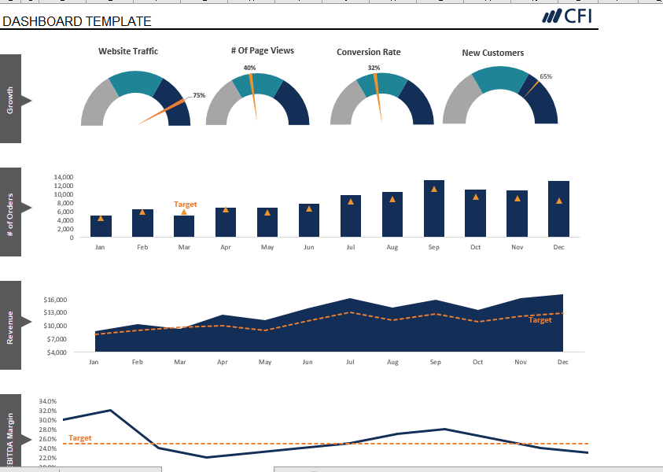
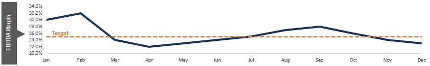
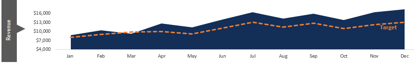
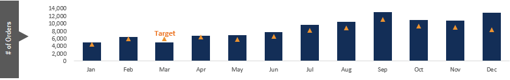

### Sales Performanc Review

### The Two-series line chart demonstrate the EBITDA Margin showing the target result versus the actual result

### Revenue data reperesented using Area chart to show the target result and the actual result

### Column chart showing the number of orders on each month and the target result indicated in each column
